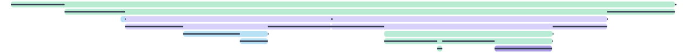

<!-- LOGO -->

<h2 align="center">OpenTelemetry AL SDK</h2>

    
    
    
    

## About The Project
Ultimate project goal is to enable APM & distributed tracing functionality for Dynamics 365 Business Central extensions by implementing [OpenTelementry API](https://github.com/open-telemetry/opentelemetry-specification) with a minimal overhead.
## Installation
**PROJECT IS IN ACTIVE DEVELOPMENT AND NOT AVAILABE FOR PRODUCTION YET**
- **For development and on-prem installation:** clone this repository, compile and deploy an app
- **For SaaS:** dependency reference will be provided shortly after first AppSource release
## Usage
TBD
## Architecture

## Roadmap
See the [open issues](https://github.com/thetanz/opentelemetry-al/issues) for a list of proposed features (and known issues).
## Contributing
Contributions are what make the open source community such an amazing place to be learn, inspire, and create. Any contributions you make are **greatly appreciated**.
1. Fork the Project
2. Create your Feature Branch (`git checkout -b feature/AmazingFeature`)
3. Commit your Changes (`git commit -m 'Add some AmazingFeature'`)
4. Push to the Branch (`git push origin feature/AmazingFeature`)
5. Open a Pull Request
## License
Distributed under the GNU v3.0. See [`LICENSE`](LICENSE) for more information.
## Contact
- Owner: [@vodyl](https://twitter.com/vodyl)
- Link: [https://github.com/thetanz/opentelemetry-al](https://github.com/thetanz/opentelemetry-al)
